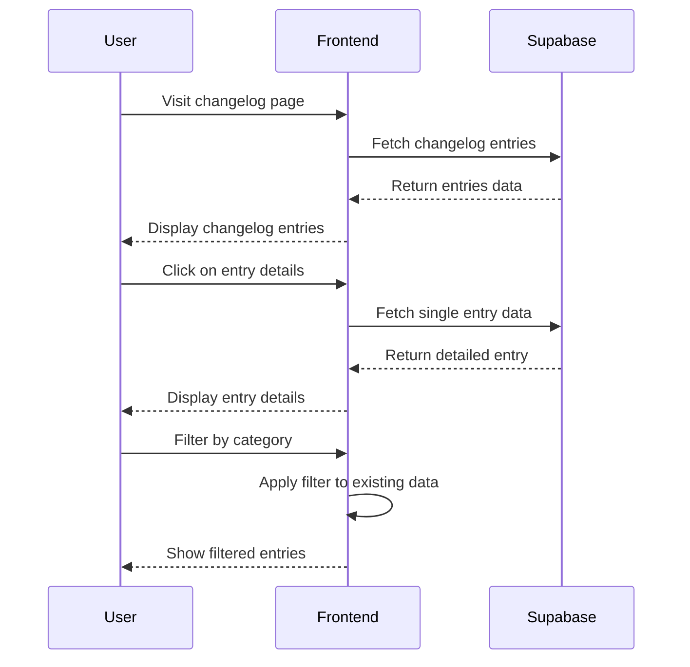
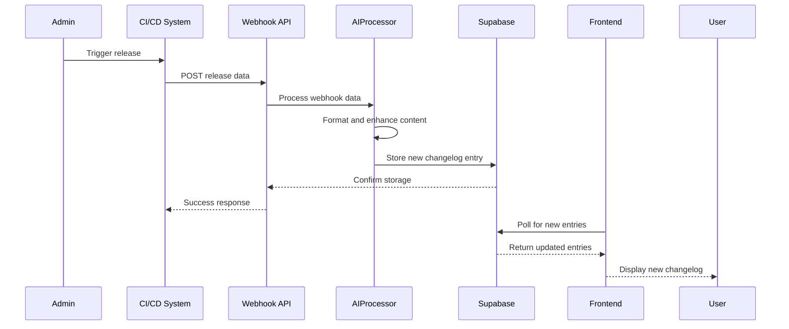
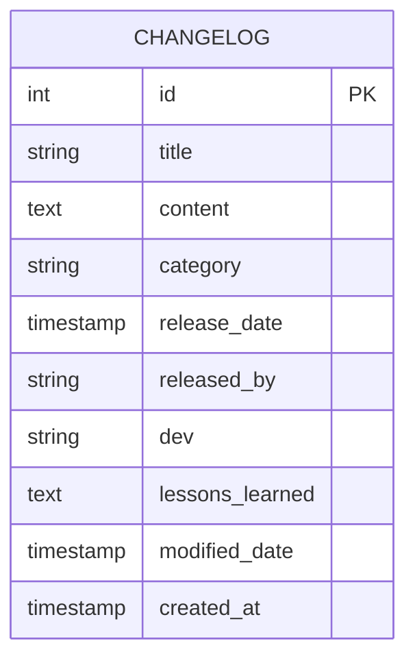
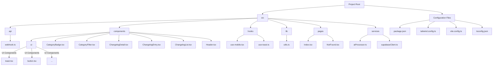

# Welcome to your Lovable project

## Project info

**URL**: https://lovable.dev/projects/ffe72f2e-edfa-4cfa-929e-d0ae51700f64

## System Architecture and Flows

### User Journey


### Admin User Flow (Webhook Integration)


### Database Schema


## API Endpoints

The application provides the following API endpoints:

### Changelog Webhook

This endpoint receives data about new changelog entries and stores them in the database.

- **URL**: `https://ycwttshvizkotcwwyjpt.supabase.co/functions/v1/changelog-api`
- **Method**: `POST`
- **Headers**:
  - `Content-Type: application/json`
  - `Authorization: Bearer <supabase_anon_key>` (for authenticated requests)

#### Request Body

```json
{
  "title": "New Feature Release v2.5.0",
  "content": "**Major improvements in this release:**\n\n- Added new features...",
  "category": "feature",
  "release_date": "2023-08-15T12:00:00Z",
  "released_by": "Release Team",
  "dev": "Dev Team Alpha",
  "lessons_learned": "**Lessons Learned:**\n\n- Cross-platform testing..." // Optional
}
```

#### Required Fields:
- `title`: The title of the changelog entry
- `content`: The detailed content of the changelog entry (supports Markdown)
- `category`: The category of the change (e.g., feature, bug, improvement)
- `release_date`: ISO 8601 formatted date when the release occurred
- `released_by`: Name of the person or team that released the update
- `dev`: Name of the developer or team that implemented the change

#### Optional Fields:
- `lessons_learned`: Lessons learned during implementation (supports Markdown)

#### Success Response

- **Status Code**: 201 Created
- **Response Body**:

```json
{
  "success": true,
  "message": "Changelog entry created successfully",
  "data": {
    "id": 123,
    "title": "New Feature Release v2.5.0",
    "content": "**Major improvements in this release:**\n\n- Added new features...",
    "category": "feature",
    "release_date": "2023-08-15T12:00:00Z",
    "released_by": "Release Team",
    "dev": "Dev Team Alpha",
    "lessons_learned": "**Lessons Learned:**\n\n- Cross-platform testing...",
    "modified_date": "2023-08-15T14:30:45Z",
    "created_at": "2023-08-15T14:30:45Z"
  },
  "version": 123
}
```

The `version` field in the response is automatically assigned based on the auto-incrementing ID in the database.

### Get All Changelog Entries

This endpoint retrieves all changelog entries, ordered by release date (newest first).

- **URL**: `https://ycwttshvizkotcwwyjpt.supabase.co/functions/v1/changelog-api/all`
- **Method**: `GET`
- **Headers**:
  - `Authorization: Bearer <supabase_anon_key>` (for authenticated requests)

#### Success Response

- **Status Code**: 200 OK
- **Response Body**:

```json
{
  "success": true,
  "data": [
    {
      "id": 123,
      "title": "New Feature Release v2.5.0",
      "content": "**Major improvements in this release:**\n\n...",
      "category": "feature",
      "release_date": "2023-08-15T12:00:00Z",
      "released_by": "Release Team",
      "dev": "Dev Team Alpha",
      "lessons_learned": "**Lessons Learned:**\n\n...",
      "modified_date": "2023-08-15T14:30:45Z",
      "created_at": "2023-08-15T14:30:45Z"
    },
    {
      "id": 122,
      "title": "Bug Fix Release v2.4.1",
      "content": "**Bug fixes in this release:**\n\n...",
      "category": "bug",
      "release_date": "2023-08-10T09:00:00Z",
      "released_by": "Release Team",
      "dev": "Dev Team Beta",
      "lessons_learned": null,
      "modified_date": "2023-08-10T10:15:30Z",
      "created_at": "2023-08-10T10:15:30Z"
    }
  ],
  "count": 2
}
```

#### Error Responses

- **Database Error**:
  - **Status Code**: 500 Internal Server Error
  - **Response Body**: `{ "error": "Error message from database" }`

- **Method Not Allowed**:
  - **Status Code**: 405 Method Not Allowed
  - **Response Body**: `{ "error": "Method not allowed" }`

- **Endpoint Not Found**:
  - **Status Code**: 404 Not Found
  - **Response Body**: `{ "error": "Endpoint not found" }`

- **Unexpected Error**:
  - **Status Code**: 500 Internal Server Error
  - **Response Body**: `{ "error": "Internal server error" }`

### Project File Structure


## How can I edit this code?

There are several ways of editing your application.

**Use Lovable**

Simply visit the [Lovable Project](https://lovable.dev/projects/ffe72f2e-edfa-4cfa-929e-d0ae51700f64) and start prompting.

Changes made via Lovable will be committed automatically to this repo.

**Use your preferred IDE**

If you want to work locally using your own IDE, you can clone this repo and push changes. Pushed changes will also be reflected in Lovable.

The only requirement is having Node.js & npm installed - [install with nvm](https://github.com/nvm-sh/nvm#installing-and-updating)

Follow these steps:

```sh
# Step 1: Clone the repository using the project's Git URL.
git clone <YOUR_GIT_URL>

# Step 2: Navigate to the project directory.
cd <YOUR_PROJECT_NAME>

# Step 3: Install the necessary dependencies.
npm i

# Step 4: Start the development server with auto-reloading and an instant preview.
npm run dev
```

**Edit a file directly in GitHub**

- Navigate to the desired file(s).
- Click the "Edit" button (pencil icon) at the top right of the file view.
- Make your changes and commit the changes.

**Use GitHub Codespaces**

- Navigate to the main page of your repository.
- Click on the "Code" button (green button) near the top right.
- Select the "Codespaces" tab.
- Click on "New codespace" to launch a new Codespace environment.
- Edit files directly within the Codespace and commit and push your changes once you're done.

## What technologies are used for this project?

This project is built with .

- Vite
- TypeScript
- React
- shadcn-ui
- Tailwind CSS

## Connecting to Supabase

This app is built to connect to Supabase for backend functionality. Here's how to connect your project:

1. Create a Supabase project at [https://supabase.com](https://supabase.com)
2. Create a `changelog` table with the following columns:
   - `id` (auto-incrementing integer, primary key)
   - `title` (text, not null)
   - `content` (text, not null)
   - `category` (text, not null)
   - `release_date` (timestamp with time zone, not null)
   - `released_by` (text, not null)
   - `dev` (text, not null)
   - `lessons_learned` (text)
   - `modified_date` (timestamp with time zone)
   - `created_at` (timestamp with time zone, default: now())

3. Create environment variables:
   - Set `VITE_SUPABASE_URL` to your Supabase project URL
   - Set `VITE_SUPABASE_KEY` to your Supabase anon/public key

Once connected, the app will automatically use your Supabase database instead of the mock data.

## API & Webhook Integration

The app supports webhooks to automatically create changelog entries. The webhook endpoint accepts POST requests with the following JSON structure:

```json
{
  "title": "New Feature Release v2.5.0",
  "content": "**Major improvements in this release:**\n\n- Added new features...",
  "category": "feature",
  "release_date": "2023-08-15T12:00:00Z",
  "released_by": "Release Team",
  "dev": "Dev Team Alpha",
  "lessons_learned": "**Lessons Learned:**\n\n- Cross-platform testing..."
}
```

This can be integrated with your CI/CD pipeline to automatically create changelog entries when releases are made.

## How can I deploy this project?

Simply open [Lovable](https://lovable.dev/projects/ffe72f2e-edfa-4cfa-929e-d0ae51700f64) and click on Share -> Publish.

## I want to use a custom domain - is that possible?

We don't support custom domains (yet). If you want to deploy your project under your own domain then we recommend using Netlify. Visit our docs for more details: [Custom domains](https://docs.lovable.dev/tips-tricks/custom-domain/)

